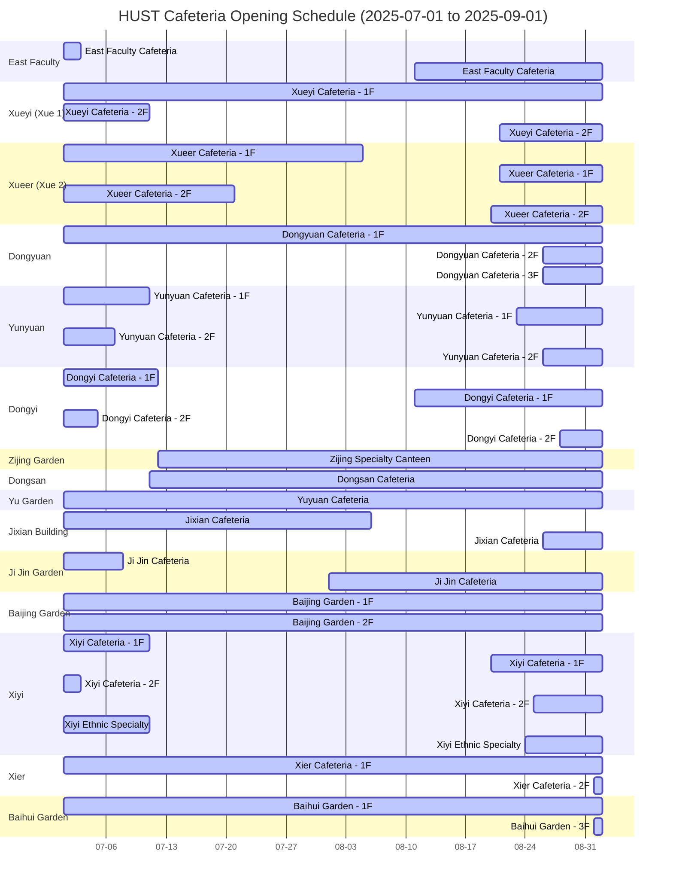
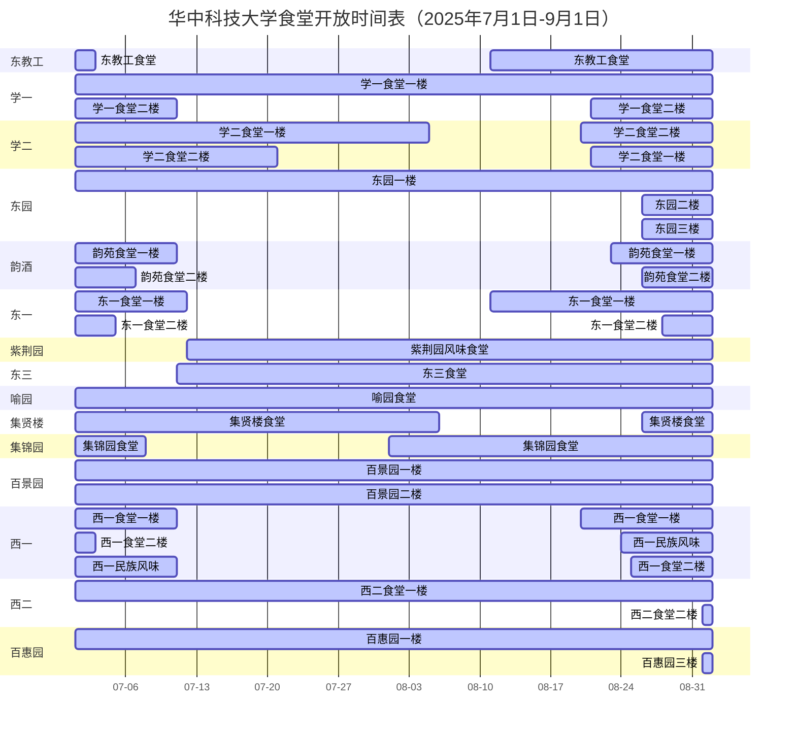

# 25S (My Summer Study Plan for 2025)

A personal project to organize and track my learning goals during the summer of 2025.

## Objective

To maintain a structured and consistent approach to learning over the summer break, with clear milestones and progress tracking.

## Features

- Goal-oriented planning  
- Weekly progress tracking  
- Modular structure for easy updates  
- Flexible for any subject or skill

## You are RIGHT, but my stomach gonna win.

en version

zn_cn version

